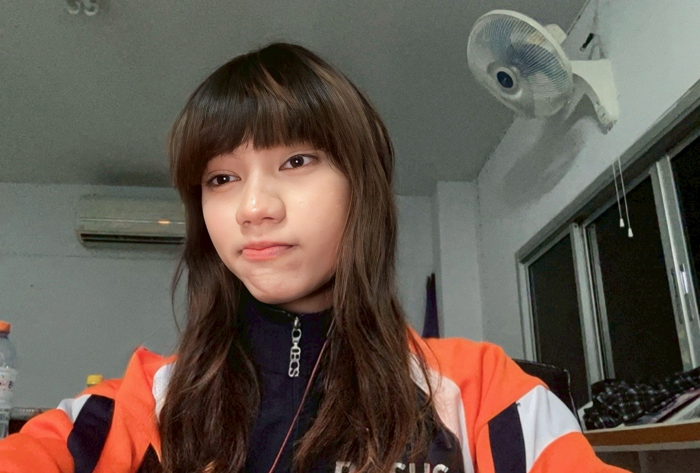
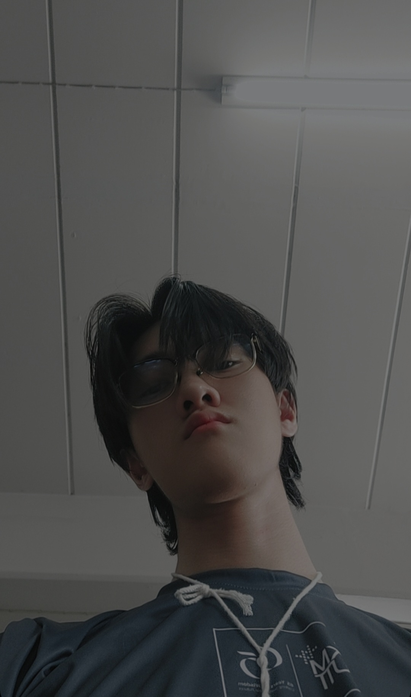
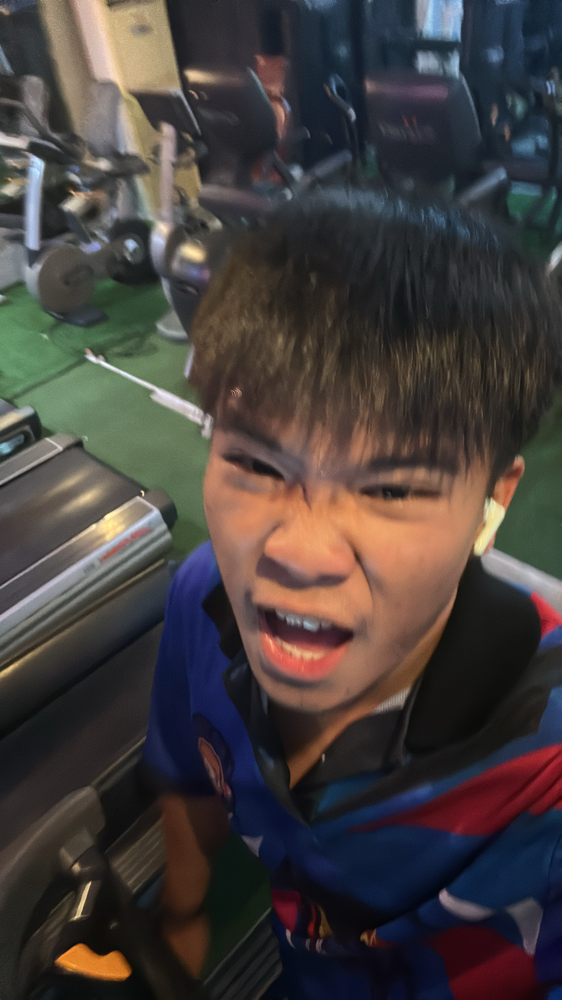
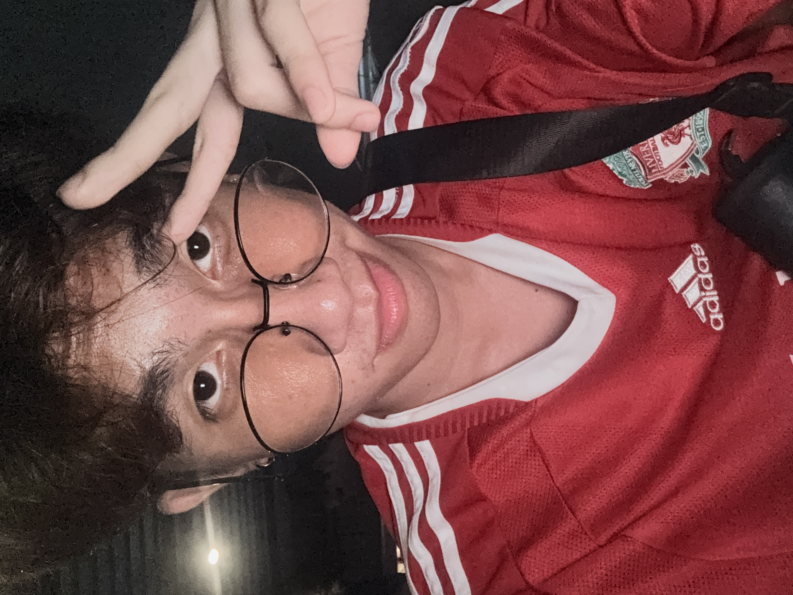

## G1-07 Digital Footlong Cheese and the team members.

### 1. นางสาว เกศชฎา คงมณี (ดา)
- Which image of yourself is your favorite? (Insert the image above the question) : 
- 
- What is your favorite social media platform? Please provide the link to your profile from that platform. : [ลิ้งค์ไอจี](https://www.instagram.com/kkedchada?igsh=YXQzbngyMDY5Z2h2&utm_source=qr)
- What is your favorite color, why? : สีชมพู เพราะว่าชอบมาตั้งแต่เด็กแล้ว น่าจะมาจากการ์ตูนตอนเด็ก
- What are the 3 emojis that can describe you the most? : :rabbit: , :hibiscus: , :pink_heart:
- If you are granted with 3 wishes, what will be your wishes? :
  - ประสบความสำเร็จในทุกอย่าง
  - รวย
  - มีโอกาสใหม่ๆเข้ามาในชีวิต
- If you can choose, what will be the last thing you wish for it to fail when everything fails? : สิ่งสุดท้ายที่อยากจะให้ล้มเหลวคือ ร่างกาย
- If you can change a thing that you do not like, what would it be? : อยากเปลี่ยนนิสัยของตัวเองที่ชอบคิดเล็กคิดน้อย
- If you won a 10 millions Baht lottery, what will you do with it? : จะเอาเงินไปลงทุน
- Suppose you have a daughter, and she came up to seek advice from you about her "one-sided love." What advice will you give? : แนะนำให้ลูกสาวลองไปบอกชอบเขาก่อน ถ้าเขาไม่ได้ชอบกลับก็ไม่เป็นไร
- What is your motto / inspirational quote? :
> All our dreams can come true — if we have the courage to pursue them.

________________________________________________________________________________

### 2. นายธีรัช สงค์ทะเล (โฮป)
- Which image of yourself is your favorite? (Insert the image above the question)

- What is your favorite social media platform? Please provide the link to your profile from that platform.
[Instagram ของโฮป](https://www.instagram.com/ur.hxpe/)
- What is your favorite color, why?
ชอบสีขาวค้าบ มันเป็นสีที่รวมแสงทุก ๆ สี แต่ในขณะเดียวกันมันก็เป็นสีที่บริสุทธิ์ เพราะถ้ามันโดนสีอื่นมันก็จะเปลี่ยนสีเลย อีกอย่างคือมันดูสบายตาด้วย
- What are the 3 emojis that can describe you the most?
: :rabbit: , :guitar: , :white_heart:
- If you are granted with 3 wishes, what will be your wishes? :
  - ประสบความสำเร็จในทุกอย่าง
  - รวย
  - ไม่อยากให้มีการนินทากันและกันในโลก
- If you can choose, what will be the last thing you wish for it to fail when everything fails?
หัวใจ :heart: เพราะไม่งั้นจะไม่มีชีวิตต่อ
- If you can change a thing that you do not like, what would it be?
อยากเปลี่ยนนิสัยตัวเองที่ชอบไม่คว้าโอกาสที่ตัวเองได้รับในหลาย ๆ ครั้ง เพราะชอบเสียใจทีหลังที่ไม่คว้ามันไว้ตั้งแต่ตอนนั้น
- If you won a 10 millions Baht lottery, what will you do with it?
ลงทุนทำในสิ่งที่ตัวเองอยากประสบความสำเร็จ
- Suppose you have a daughter, and she came up to seek advice from you about her "one-sided love." What advice will you give?
บอกลูกสาวตรงๆเลยว่าถ้าแอบชอบใครก็บอกเขาไปเลยไม่ต้องกลัว ถ้ากั๊กไว้ก็ไม่เกิดอะไรขึ้นสักที ถ้าลูกสาวกลัวเสียเขาไปก็จะบอกว่าคนคนนี้ไม่ใช่คนเดียวบนโลก ยังมีอีกหลายคนที่เราต้องเจอ ไม่ต้องกลัวว่าถ้าเสียไปแล้วจะเป็นอะไร ก็แค่มูฟออนแล้วเริ่มใหม่ แต่ถ้าลูกไม่บอกตอนนี้จะมาเสียใจทีหลังน้า
- What is your motto / inspirational quote?
> It's fine to celebrate success but it is more important 

________________________________________________________________________________

### 3. ณัฐนัย กนกเฉลิมพรรณ (โซดา) 
- Which image of yourself is your favorite? (Insert the image above the question) : 
- 
- What is your favorite social media platform? Please provide the link to your profile from that platform. : [ลิ้งค์ไอจี](https://www.instagram.com/z.rian2x?igsh=aDNqbTlnNWZlbXEz)
- What is your favorite color, why? : ชอบสีน้ำเงินเข้มเพราะมันดูลึกลับและเย็นชาดี haha
- What are the 3 emojis that can describe you the most? : :thinking: , :sleeping:	 , :monocle_face:
- If you are granted with 3 wishes, what will be your wishes? :
  - ขอให้มีเงิน
  - ขอให้แข็งแรงกว่านี้
  - ขอเวลาว่าง
- If you can choose, what will be the last thing you wish for it to fail when everything fails? : ตาย จะได้ไม่เห็นผล
- If you can change a thing that you do not like, what would it be? : เปลี่ยนพรรครัฐบาลใหม่ :<
- If you won a 10 millions Baht lottery, what will you do with it? : 4ล้านซื้อบ้าน 1ล้านซื้อความสุข 4ล้านลงทุน 1ล้านให้ครอบครัว
- Suppose you have a daughter, and she came up to seek advice from you about her "one-sided love." What advice will you give? : ผู้ชาย / ผู้หญิงไม่ได้มีคนเดียวบนโลกซะหน่อย อย่าไปรักคนที่เขาไม่ได้รักเราเลย ออกไปเจอสังคมใหม่ๆดู
- What is your motto / inspirational quote? :
> ถ้าคนตรงหน้าไม่ใช่ คนในใจยิ่งชัดเจน.

________________________________________________________________________________

### 4. ณภัทร บุญมา (ปั้น)
- 
- What is your favorite social media platform? Please provide the link to your profile from that platform. : [IG ของปั้น](https://www.instagram.com/_px.nnn?igsh=OGF2aGJtZDFvajBn&utm_source=qr)
- What is your favorite color, why? : ชอบสีฟ้า เพราะว่า เวลาเรามองเราจะรู้สึกสบายใจที่ได้เห็นสีนี้
- What are the 3 emojis that can describe you the most? : :neutral_face: :muscle: :parrot:
- If you are granted with 3 wishes, what will be your wishes? :
    1.อยากให้ร่างกายแข็งแรงไปตลอด
    2.อยากให้รวยมากๆ มีเท่าไหร่ใช้ไม่หมด
    3.ไม่มีความทุกข์
- If you can choose, what will be the last thing you wish for it to fail when everything fails? : อยากให้ร่างกายเป็นสิ่งสุดท้าย
- If you can change a thing that you do not like, what would it be? : อยากเปลี่ยนส่วนสูงตัวเอง อยากสูงกว่านี้
- If you won a 10 millions Baht lottery, what will you do with it? : เอาไปลงทุนทำธุรกิจของตัวเอง
- Suppose you have a daughter, and she came up to seek advice from you about her "one-sided love." What advice will you give? : แนะนำให้บอกเขาไปตรงๆ จะได้รู้คำตอบไปเลย
- What is your motto / inspirational quote? :
> Success start with self discipline

________________________________________________________________________________

### 5. นางสาว ณาริษา บุบผา (พอ)

- Which image of yourself is your favorite? (Insert the image above the question) : 
- What is your favorite social media platform? Please provide the link to your profile from that platform. : [ลิ้งค์ไอจี](https://www.instagram.com/n4rlsa_p0r?igsh=dmNhbWh0bG04N25w&utm_source=qr)
- What is your favorite color, why? : สีชมพู เพราะว่า เป็นสีที่ดูสดใส อ่อนโยน มุ้งมิ้ง
- What are the 3 emojis that can describe you the most? : :cat2:,:bouquet:,:apple:
- If you are granted with 3 wishes, what will be your wishes? :
 1.) ขอให้ได้อยู่กับครอบครัวและะคนที่รักไปนานๆ
 2.)ขอถูกหวย 2 ตัวตรงทุกงวด สาธุ 99
 3.) มีพลังวิเศษไปไหนก็ได้จะได้ไปเที่ยวรอบโลก
- If you can choose, what will be the last thing you wish for it to fail when everything fails? : ความสัมพันธ์ของครอบครัวและคนที่รัก
- If you can change a thing that you do not like, what would it be? : อยากให้ตัวเองเป็นคนเลิกคิดมาก มีอะไรชอบเก็บไว้คนเดียว
- If you won a 10 millions Baht lottery, what will you do with it? : เอาเงินไปเลี้ยงแมวว อยากให้แมวทุกตัวได้กินอิ่มนอนหลับ
- Suppose you have a daughter, and she came up to seek advice from you about her "one-sided love." What advice will you give? : บอกลูกว่าไปบอกชอบเขาเลยถ้าเขาไม่ชอบก็แค่หาใหม่ ไม่ได้มีคนเดียวบนโลกลูก
- What is your motto / inspirational quote? : 
> ทำวันนี้นี้ให้ดีที่สุด

________________________________________________________________________________

### 6. นายพงศ์ภรณ์ สุนทรานุรักษ์ (ป๋อง)

- Which image of yourself is your favorite? (Insert the image above the question) : 
- What is your favorite social media platform? Please provide the link to your profile from that platform. : [ไอจีพี่ป๋อง](https://www.instagram.com/pho_pxng?igsh=ZzlraHZlcG1tcTZ6&utm_source=qr)
- What is your favorite color, why? : ปกติชอบสีเขียว แต่ตอนนี้ชอบสีขาว รู้สึกว่าสีขาวทำให้ไม่ค่อยคิดมาก
- What are the 3 emojis that can describe you the most? : :pouting_cat:, :zzz:, :confounded:
- If you are granted with 3 wishes, what will be your wishes? :
  - อยากรวยๆๆ จะเอาเงินไปซื้อของกินกินให้อ้วนไปเลยย
  - หาแฟนที่จริงใจ
  - ขอให้ขอพรเพิ่มได้ 100 ข้อ 3ข้อ ไม่พอ
- If you can choose, what will be the last thing you wish for it to fail when everything fails? : สิ่งสุดท้ายที่อยากให้พังคือความเชื่อว่า ‘พรุ่งนี้ยังดีกว่าเดิมได้’ เพราะมันคือแรงบันดาลใจที่ทำให้มีชีวิตอยู่ต่อ
- If you can change a thing that you do not like, what would it be? : ไม่ชอบที่เกิดมาผอม ตอนนี้น้ำหนักป๋องอยู่ที่ 40 มาตั้งแต่ ม.ต้นแล้ว มหาลัยก็ยัง 40 อยู่ดี อยากหนักสัก 55 รู้สึกตอนนี้ผอมเกินน
- If you won a 10 millions Baht lottery, what will you do with it? : ซื้อของกิน สร้างห้องส่วนตัว อยากเติมเกิมจนมีทุกสกิน ซื้อไม้แบตรองเท้าแบตที่ชอบ
- Suppose you have a daughter, and she came up to seek advice from you about her "one-sided love." What advice will you give? : บอกลูกสาวว่าถ้าไม่ทักรักไม่เกิดก็ลองให้ลูกทักดูถ้าไม่ได้ก็ค่อยปลอบลูกว่ามีคนอีกเป็น 10 ล้านคนรออยู่
- What is your motto / inspirational quote? :
> อย่าเสียใจกับอะไรที่พยายามเต็มที่แล้ว